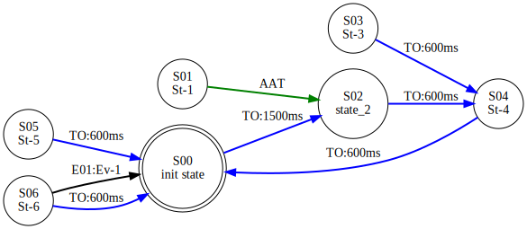

### FSM graph rendering

- [Homepage](https://github.com/skramm/spaghetti)
- [Manual](spaghetti_manual.md)

This library does not produce graphical rendering of the state machine.
But it provides a function to generate a [standard dot file](https://en.wikipedia.org/wiki/DOT_%28graph_description_language%29), that can be used to generate the corresponding image, using [Graphviz](https://www.graphviz.org/).

To use it with default options:
```C++
	fsm_t fsm;
	...
	fsm.writeDotFile( "myDotFile" );
```
This will produce in the current folder the file ```myDotFile.dot```.
You can render into an svg image with:
```
$ dot -Tsvg myDotFile.dot > myGraph.svg
```
or
```
$ dot -Tpng myDotFile.dot > myGraph.png
```
for a png image.

Several options can be used, they are embedded in the ```spag::DotFileOptions``` data type.

The available options and default values are:

```
showActiveState = false
showTimeOuts    = true
showInnerEvents = true
showAAT         = true
showStateIndex  = true
showStateString = true
showEventIndex  = true
showEventString = true
showUnreachableStates = true
fixedNodeWidth = false
useColorsEventType = true
```
If you want to change one of these, instanciate this object, change one of the members value, and call the function by adding the options.
For example:

```C++
	spag::DotFileOptions dfo;
	dfo.showActiveState = true;
	fsm.writeDotFile( "myDotFile", dfo );
```

The included test file `tests/testA_2.cpp` does a demo of these options.
It has unreachable states to show how these can be removed from the rendering.
This can be useful when handling a complex situation where you would want to printout a rendering while FSM is partially configured.
The table below shows for the same FSM different renderings, when one option changes from the default value.

| Option |  Rendering |
|-----------------------|----------------------------|
| Default               |  |
| showActiveState=true  |  |
| showInnerEvents=false |  |
| showAAT=false         |  |
| showTimeOuts=false    |  |
| showEventIndex=false  |  |
| showEventString=false |  |
| showStateIndex=false  |  |
| showStateString=false |  |
| showUnreachableStates=false |  |
| fixedNodeWidth=true         |  |
| useColorsEventType=false    |  |

When rendering with Graphviz, the size of the nodes are set automatically.
If you prefer a fixed size, then you can set `fixedNodeWidth` to true, and assign the requested size (in inches) with `nodeWidth`.
The default value is "1.5".
For example:

```C++
	spag::DotFileOptions dfo;
	dfo.fixedNodeWidth = true;
	dfo.nodeWidth = "1.2";
	fsm.writeDotFile( "myDotFile", dfo );
```

The edges are colored depending on their type
- external event: black
- time out event: blue
- Internal event: red
- Always Active Transition (AAT): green

This can be disabled by setting `useColorsEventType` to `false`.


--- Copyright S. Kramm - 2018-2019 ---
